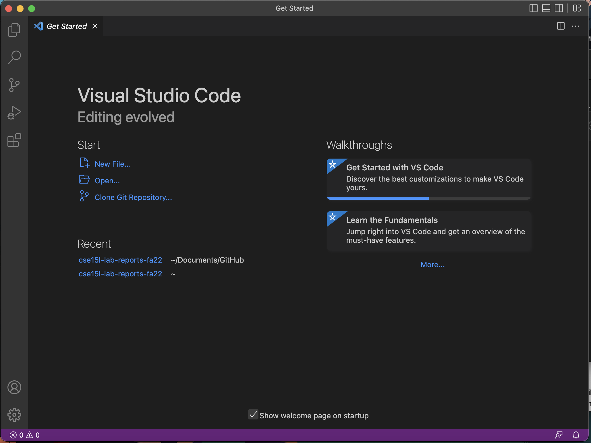

# Lab Report 1 (Week 1)
## CSE 15L Startup Tutorial


### Part 1 - Visual Studio Code
The first step for starting out in CSE 15L is to download an IDE (Integrated Development Environment). The IDE we use for CSE 15L is Visual Studio Code which can be downloaded here  https://code.visualstudio.com/. IDEs can be helpful as they allow programmers to develop actual code in an efficient manner.

Once you have installed the application, you should be able to open a window that looks similar to this


### Part 2 - Remotely Connecting

Then next part in starting out in this class is connecting to UCSD's servers. The way we do this is by using the terminal. First if you are using a windows computer you need to download [OpenSSH](https://learn.microsoft.com/en-us/windows-server/administration/openssh/openssh_install_firstuse?tabs=gui).

After that, you can run the command in your terminal but replace .. with the letters in your specific CSE 15L account
```
ssh cs15lfa22..@ieng6.ucsd.edu
```