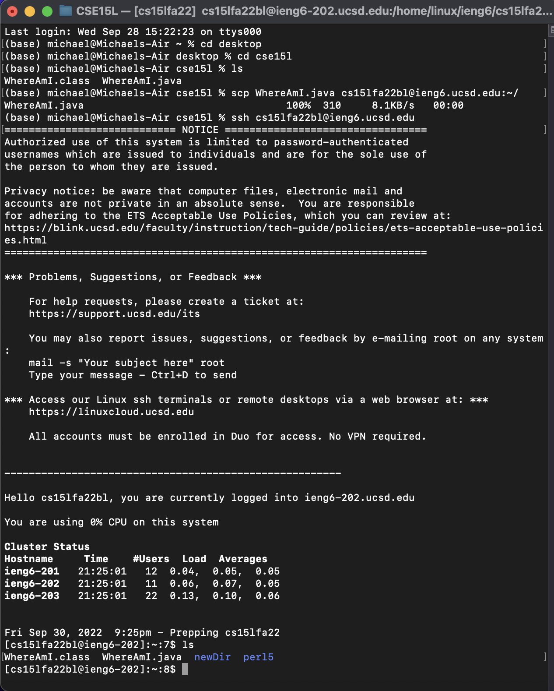

# Lab Report 1 (Week 1)
## CSE 15L Startup Tutorial


### Part 1 - Visual Studio Code
The first step for starting out in CSE 15L is to download an IDE (Integrated Development Environment). The IDE we use for CSE 15L is Visual Studio Code which can be downloaded here  https://code.visualstudio.com/. IDEs can be helpful as they allow programmers to develop actual code in an efficient manner.

Once you have installed the application, you should be able to open a window that looks similar to this


### Part 2 - Remotely Connecting

Then next part in starting out in this class is connecting to UCSD's servers. The way we do this is by using the terminal. First if you are using a windows computer you need to download [OpenSSH](https://learn.microsoft.com/en-us/windows-server/administration/openssh/openssh_install_firstuse?tabs=gui).

After that, you can run the command in your terminal but replace .. with the letters in your specific CSE 15L account
```
ssh cs15lfa22..@ieng6.ucsd.edu
```
after this you should be able to type in your password and log in and your terminal should have an output similar to this

```
Last login: Sun Jan  2 14:03:05 2022 from 107-217-10-235.lightspeed.sndgca.sbcglobal.net
quota: No filesystem specified.
Hello cs15lfa22zz, you are currently logged into ieng6-203.ucsd.edu

You are using 0% CPU on this system

Cluster Status 
Hostname     Time    #Users  Load  Averages  
ieng6-201   23:25:01   0  0.08,  0.17,  0.11
ieng6-202   23:25:01   1  0.09,  0.15,  0.11
ieng6-203   23:25:01   1  0.08,  0.15,  0.11

Sun Jan 02, 2022 11:28pm - Prepping cs15lfa22
```
Now you are logged into the remote computer in the UCSD system.

### Part 3 - Trying out Commands

Now that you are in the remote computer you can try running some comands to test out in your terminal specfic commands that can be used are:

- cd
- ls
- mkdir
- cat
- touch
- exit

an example of some commands being ran can be seen here:


### Part 4 - Moving Files between Servers

Since we have been able to run some commands the next step is transferring files to and from the remote server. The most simple way to do this is by using the command scp. With these we can easily transfer files from our own computer to the remote server.

For example we have a compiled java file called WhereAmI.java with the following code:

```
class WhereAmI {
  public static void main(String[] args) {
    System.out.println(System.getProperty("os.name"));
    System.out.println(System.getProperty("user.name"));
    System.out.println(System.getProperty("user.home"));
    System.out.println(System.getProperty("user.dir"));
  }
}
```
With this make sure you are in the folder containing WhereAmI.java and run the scp command
```
scp WhereAmI.java cs15lfa22zz@ieng6.ucsd.edu:~/
```
once this is command is ran then we should have WhereAmI.java file as shown in the example below


### Part 5 - Setting an SSH Key

The next step is to optimize the time it takes for us to get between our two servers. We have had to type our password each time we enter the remote server, which is inefficient as we will most likely need to be doing this many many times over the course of CSE 15L. The way to get around this is by ssh keys. To generate an ssh key use the command
```
ssh-keygen
```

After this is ran the terminal should look similar to this
```
$ ssh-keygen
Generating public/private rsa key pair.
Enter file in which to save the key (/Users/joe/.ssh/id_rsa): /Users/joe/.ssh/id_rsa
Enter passphrase (empty for no passphrase): 
Enter same passphrase again: 
Your identification has been saved in /Users/joe/.ssh/id_rsa.
Your public key has been saved in /Users/joe/.ssh/id_rsa.pub.
The key fingerprint is:
SHA256:jZaZH6fI8E2I1D35hnvGeBePQ4ELOf2Ge+G0XknoXp0 joe@Joes-Mac-mini.local
The key's randomart image is:
+---[RSA 3072]----+
|                 |
|       . . + .   |
|      . . B o .  |
|     . . B * +.. |
|      o S = *.B. |
|       = = O.*.*+|
|        + * *.BE+|
|           +.+.o |
|             ..  |
+----[SHA256]-----+
```

You should save the file under /Users/(name)/.ssh/id_rsa where name is the name of your computer.

After this you can then run the following command on your client
```
$ ssh cs15lfa22zz@ieng6.ucsd.edu
<Enter Password>
```
Then in the remote server run the following command
```
$ mkdir .ssh
$ exit
```
Then back in your client run the final scp command
```
$ scp /Users/joe/.ssh/id_rsa.pub cs15lfa22@ieng6.ucsd.edu:~/.ssh/authorized_keys
```
Now you should be able to login to your ucsd account without needing your password as shown below:


### Part 6 - Optimizing Route Running

now that you have the ability to enter the remote console without the password is easy to connect between the two. And within the terminal you are even able to run commands on your remote server from your client with commands such as
```
$ ssh cs15lfa22@ieng6.ucsd.edu "ls"
```

Further optimization is the key to getting faster at coding and more efficient in your workspace.


