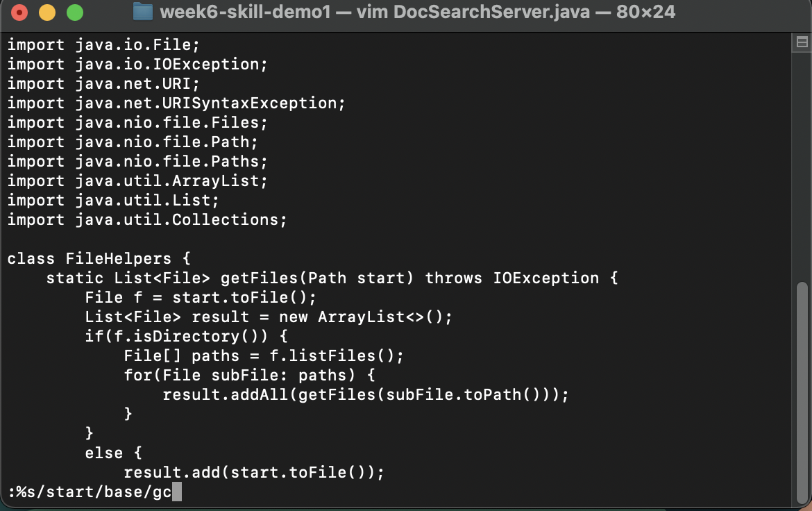

# Lab Report 4 (Week 7)
## Vim

### Part 1 - Week 6 Task
For this part I will be talking about the task of changin start to base. For this task our group came up with the following key inputs:
: % s  / s t a r t / b a s e / g c <Enter> y y y n 

