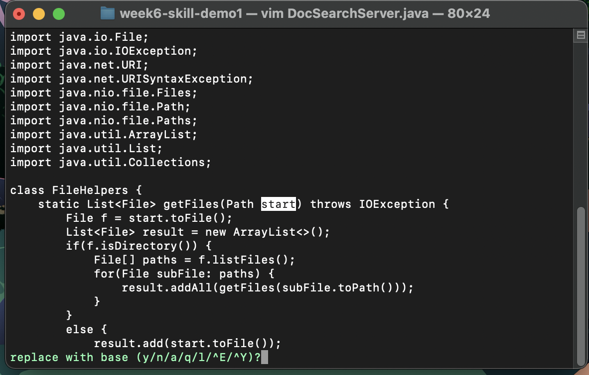
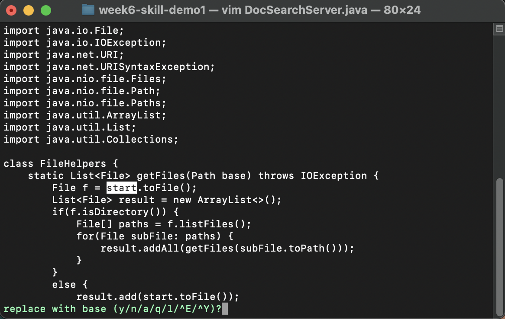
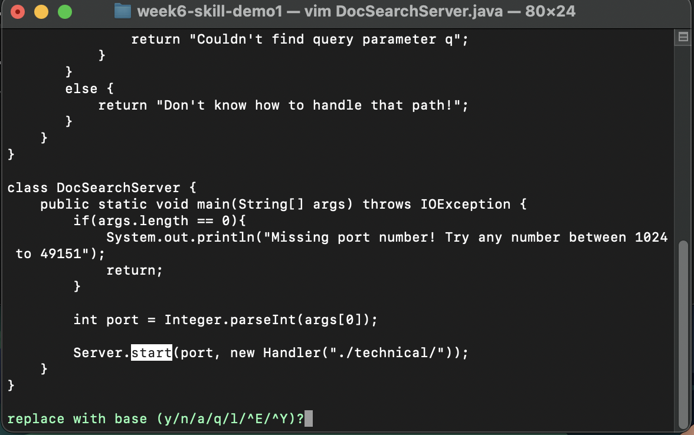
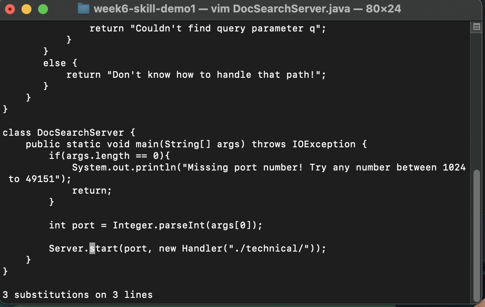
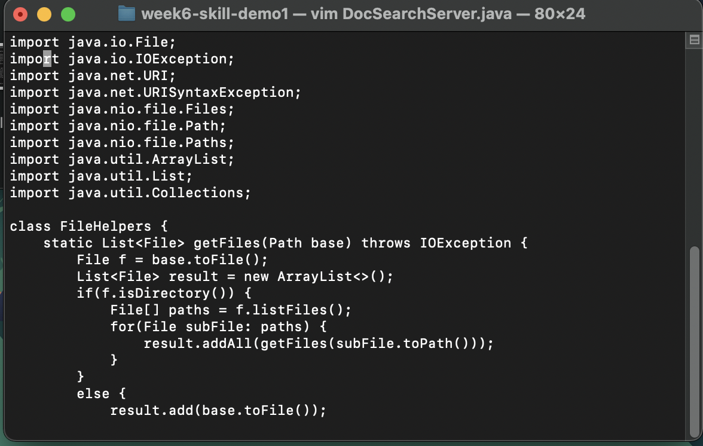

# Lab Report 4 (Week 7)

## Part 1 - Week 6 Task
For this part I will be talking about the task of changin start to base. For this task our group came up with the following key inputs:
: % s  / s t a r t / b a s e / g c <Enter> y y y n : w <Enter>

The overall goal of these inputs is to run a command that will change each start in the program to base, and also ask us to confirm for each individual change. After running that command we will change the first 3 starts to base but not the last one as this will mess up the program.

This image shows the initial command that I spoke about earlier. The command starts with %s which states that this command will search the whole document. /start means that we will be changing each occurence of this word to the word after the next slash which is base. then g states to replace all occurences in each line and c means to confirm each one.

After we press enter the hud which the confirmations take place in shows up. In this state pressing y will replace the highlihgted start with base, and pressing n will make it so the highlighted start is not changed.

After pressing y, the document now shows that the first start got changed to base, and the next base in the file is highlighted. we will press y again to change this start as well

The first image shows the final start highlighted which is the one that we do not want to change. We press n to confirm that we dont want to change this start and the second image shows that this start was not changed.

This image shows the first 3 starts changed to base in the start of the file which was the overall goal.

## Part 2 - A comparison of Vim vs VSCode

### VSCode

When starting out in vscode I found it took me around 55 seconds to do my changes and scp the files over to the ieng6 server. I personally beleive that the main problem going about the task this way is the issue of converting and then having to scp. This adds a good amount of time compared to the other option

### Vim

When starting already logged inot the ssh session it took me 25 seconds to do my changes and save the file then run bash test.sh. I believe the main difference in time was the absence of a need to scp files over to a server. Also because i knew the exact edits I needed to make the entire process i needed to perform down to the keystroke was right in front of me allowing me to perform the task this way pretty efficiently.

### Overview

I believe that between these two styles I think there are advantages and disadvantages to both. I believe that VSCode's UI and ease of access to a whole file system means that it is much more efficient for my current workflow especially for projects larger than one file. However in the case of making single line edis, Vim is much more efficient and faster at making the changes and saving them. I believe that while both of these ways have a purpose and a better place in which they are used, using them together will most likely lead to the highest efficiency in overall coding.
